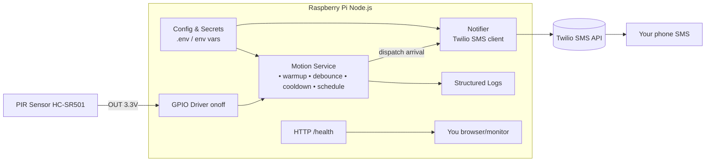

Awesome—here’s a tight, complete plan you can build from.

# Feature overview

* **Detect arrival** using a PIR sensor at the entryway.
* **Filter noise**: warm-up handling, debounce, and cooldown to avoid SMS spam.
* **Time ## 11) Raspberry Pi Camera Integration

**Tests**

* `takes photo on arrival detection`
* `uploads photo to S3 with timestamp filename`
* `handles camera capture errors gracefully`
* `handles S3 upload failures gracefully`
* `cleans up local photos after successful upload`

**Implement**

* Add dependencies: `npm i aws-sdk sharp raspicam`
* Create `camera.ts`:
  * `capturePhoto(): Promise<string>` - captures photo and returns local file path
  * Uses `raspicam` library to interface with Pi camera module
  * Saves photos with timestamp: `arrival-YYYY-MM-DD-HH-mm-ss.jpg`
* Create `s3-uploader.ts`:
  * `uploadPhoto(filePath: string): Promise<string>` - uploads to S3 and returns S3 URL
  * Uses AWS SDK with credentials from environment
  * Organizes photos in S3 with date-based prefixes: `arrivals/YYYY/MM/DD/`
* Update `motion.ts`:
  * On valid arrival detection:
    1. Send SMS notification (existing)
    2. Capture photo
    3. Upload to S3
    4. Clean up local file
  * Log all camera/upload operations
  * Continue normal operation even if camera/upload fails
* Add config variables:
  * `CAMERA_ENABLED` (boolean, default true)
  * `AWS_ACCESS_KEY_ID`, `AWS_SECRET_ACCESS_KEY`, `AWS_REGION`
  * `S3_BUCKET_NAME`
  * `PHOTO_CLEANUP_ENABLED` (boolean, default true)

**Hardware Setup**

* Connect Raspberry Pi Camera Module v2 to CSI port
* Enable camera in `raspi-config`: `sudo raspi-config` → Interface Options → Camera → Enable
* Test camera: `raspistill -o test.jpg`

**S3 Setup**

* Create S3 bucket with appropriate permissions
* Create IAM user with S3 upload permissions for the bucket
* Configure bucket policy for organized storage and lifecycle rules

## Backlog / nice-to-have

* Presence check (skip SMS if your phone is on home Wi-Fi).
* Event history (SQLite) and a tiny web dashboard.
* Home/Away schedule presets and holiday mute.
* Secondary notifier (Telegram) and "nighttime escalation to SMS".
* Motion-triggered video recording (short clips instead of/in addition to photos).
* Photo analysis using AWS Rekognition to identify known vs unknown faces.
* Local photo storage with web gallery for reviewing arrival photos.
* Photo compression and thumbnail generation for faster uploads.

If you want, I can turn this into a starter repo layout with stubbed files and the first test suite ready to run. (optional): only notify during configured hours.
* **Single notifier**: Twilio SMS (pluggable so you can add Telegram/Email later).
* **Config via env** (GPIO pin, cooldown, phone numbers, Twilio creds).
* **Health & logs**: simple `/health` endpoint and structured logs.
* **Autostart** with PM2 or systemd on the Pi.

# Architecture (Mermaid)



# Flow description

1. **Motion event** rises on the PIR’s `OUT` pin → GPIO driver emits a change.
2. **Motion Service**:

   * Ignores during **warm-up** (first \~60s after boot).
   * **Debounce** short flutters (e.g., <200–500 ms).
   * Enforces **cooldown** (e.g., ≥60s between alerts).
   * Optional **schedule** (only alert during configured hours).
3. On a valid “arrival” event, **Notifier** composes a message and calls **Twilio**.
4. Twilio delivers **SMS** to your phone.
5. Logs capture every step; `/health` returns `{ ok: true }` if running.

---

# Step-by-step implementation plan (TDD style)

## 0) Project scaffold

* Init repo: `npm init -y`
* Add libs: `npm i onoff twilio express dotenv`
* Add test stack: `npm i -D vitest @vitest/coverage-v8 nock sinon`
* Scripts:

  * `"test": "vitest run --coverage"`
  * `"dev": "vitest"`

**Structure**

```
src/
  config.ts
  gpio.ts
  motion.ts
  notifier.twilio.ts
  server.ts           # /health endpoint
  app.ts              # wire everything
tests/
  motion.test.ts
  notifier.twilio.test.ts
  app.integration.test.ts
.gitignore
```

## 1) Config (red → green → refactor)

Add node_modules and .env to .gitignore

**Tests you write first**

* `loads env defaults when vars missing`
* `throws if required Twilio creds missing in prod`
* `parses numeric env (cooldown ms, pin)`

**Implement**

* `config.ts` reads env (`dotenv` in dev), exports:

  * `GPIO_PIN` (default 17), `COOLDOWN_MS` (default 60000), `WARMUP_MS` (60000), `DEBOUNCE_MS` (300), optional `ACTIVE_FROM`/`ACTIVE_TO` (HH\:mm), `TWILIO_*`, `TO_NUMBER`, `FROM_NUMBER`, `NODE_ENV`.

## 2) Notifier (Twilio) with mocks

**Tests**

* `sends SMS with correct to/from/body`
* `bubbles up Twilio API errors`
* `redacts secrets in error logs`

**Implement**

* `notifier.twilio.ts` exports `sendArrival(message: string): Promise<void>`
* Use dependency injection to pass a Twilio client; in tests, **mock** with `sinon` or `nock` (HTTP).

## 3) Motion Service (core logic)

**Given we can’t poke real GPIO in tests, model it as an EventEmitter.**

**Tests**

* `ignores events during warmup window`
* `debounces bursts: multiple edges within DEBOUNCE_MS -> one logical motion`
* `cooldown blocks repeated alerts within COOLDOWN_MS`
* `respects schedule (inside -> sends, outside -> skips)`
* `on valid motion -> calls notifier exactly once`

**Implement**

* `motion.ts` exports a `createMotionService({ gpio, notifier, config, clock })`
* Internal state:

  * `lastMotionAt`, `initializedAt`
* Logic:

  1. On rising edge `value===1` → if `now - initializedAt < WARMUP_MS` → ignore.
  2. Debounce: ignore if `now - lastEdge < DEBOUNCE_MS`.
  3. Schedule check (if configured).
  4. Cooldown: ignore if `now - lastAlertAt < COOLDOWN_MS`.
  5. Call `notifier.sendArrival(message)`.
* Use an injected `clock()` (returns Date.now) so tests can **time-travel**.

## 4) GPIO Adapter

**Tests**

* `wires onoff to EventEmitter API`
* `cleans up on close()`

**Implement**

* `gpio.ts` wraps `new Gpio(GPIO_PIN, 'in', 'both')` and emits “change” events with `{ value }`.
* Provide `close()` that `unexport()`s.

*(In unit tests, swap this with a fake emitter.)*

## 5) Health server

**Tests**

* `GET /health -> 200 { ok: true }`
* `health does not block exit`

**Implement**

* `server.ts` with Express on (e.g.) port 3000.

## 6) Application wiring

**Tests (integration with fakes)**

* With fake GPIO + fake Notifier:

  * `emitting rising edge after warmup triggers one SMS`
  * `two edges inside cooldown -> one SMS`
  * `edge outside active hours -> zero SMS`

**Implement**

* `app.ts`:

  * Load config.
  * Start health server.
  * Init GPIO, Motion Service, Twilio notifier.
  * Handle SIGINT: close GPIO, stop server, exit 0.

## 7) Observability & resilience

**Tests**

* `logs structured JSON lines with level, msg, ts`
* `retries Twilio 429/5xx with jittered backoff (max N tries)`
* `does not crash on Twilio failure; logs and continues`

**Implement**

* Small `logger.ts` (console.log JSON).
* Add retry wrapper around notifier (exponential backoff, capped).

## 8) Run on the Pi

* Enable GPIO access (run under a user in `gpio` group, or use `sudo`).
* Create `.env`:

  ```
  TWILIO_ACCOUNT_SID=...
  TWILIO_AUTH_TOKEN=...
  FROM_NUMBER=+1...
  TO_NUMBER=+46...
  GPIO_PIN=17
  COOLDOWN_MS=60000
  WARMUP_MS=60000
  DEBOUNCE_MS=300
  ACTIVE_FROM=06:30
  ACTIVE_TO=23:30
  ```
* Start locally: `node dist/app.js` (use `ts-node`/plain JS as you prefer).

## 9) Autostart

**PM2**

* `npm i -g pm2`
* `pm2 start dist/app.js --name pir-sms`
* `pm2 save && pm2 startup`

*(Or create a `systemd` unit with `Restart=always` and an `EnvironmentFile=/etc/pir-sms.env`.)*

## 10) Acceptance tests (on-device)

* Walk past the sensor → receive exactly **one** SMS.
* Trigger twice within cooldown → receive **one** SMS.
* Trigger outside active hours → **no** SMS.
* Kill network (pull Ethernet/disable Wi-Fi) → app logs Twilio errors, does not crash.
* Reboot Pi → service starts automatically; warm-up respected; next valid motion → SMS.

---

## Backlog / nice-to-have

* Presence check (skip SMS if your phone is on home Wi-Fi).
* Event history (SQLite) and a tiny web dashboard.
* Home/Away schedule presets and holiday mute.
* Secondary notifier (Telegram) and “nighttime escalation to SMS”.

If you want, I can turn this into a starter repo layout with stubbed files and the first test suite ready to run.
